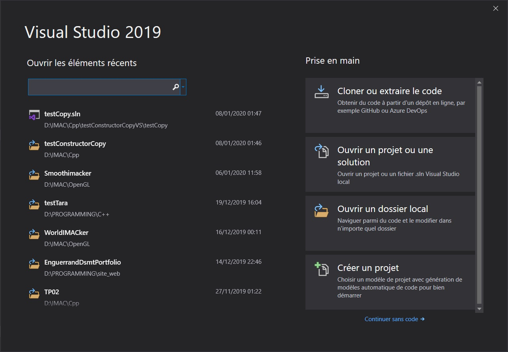

# Smoothimacker
projet S3 IMAC openGL 

## comment build le projet

Il faut dans un proemier temps installer CMake (3.7 or higher)  : https://cmake.org/download/

Sur windows via Visual Studio Code : 

ajouter le dossier du projet au workspace et lancer la commande de build depuis l'onglet Cmake

Sur windows via Visual Studio 2019 :

ouvrir Visual Studio 2019 sans code puis selectionner le fichier CMakeLists du projet

